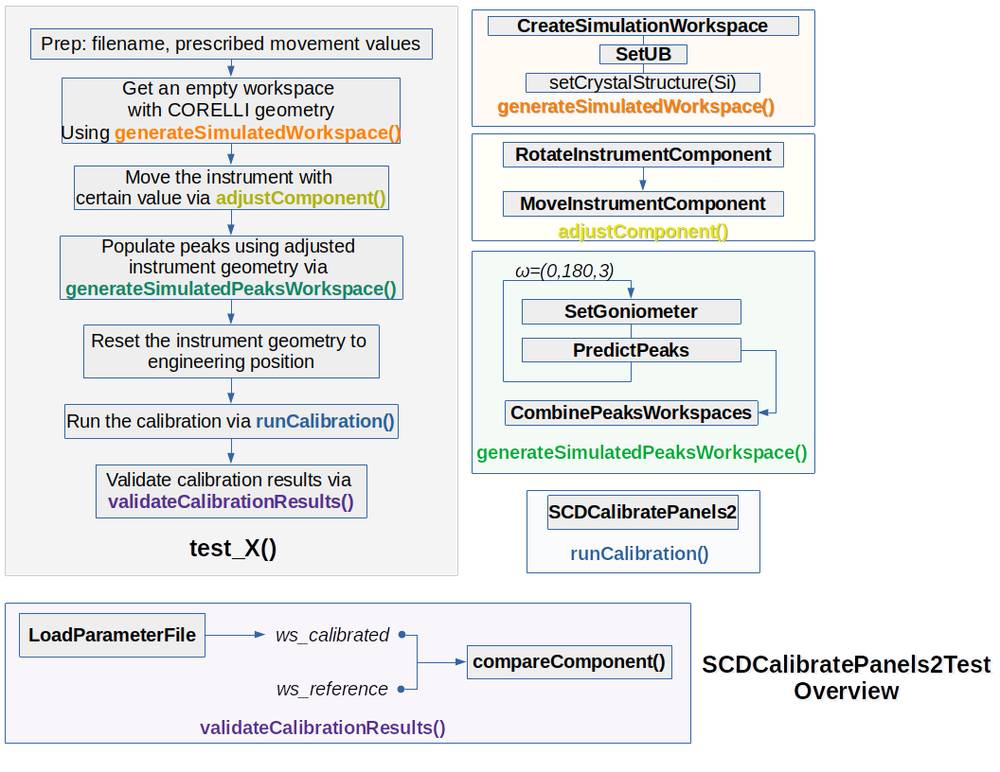
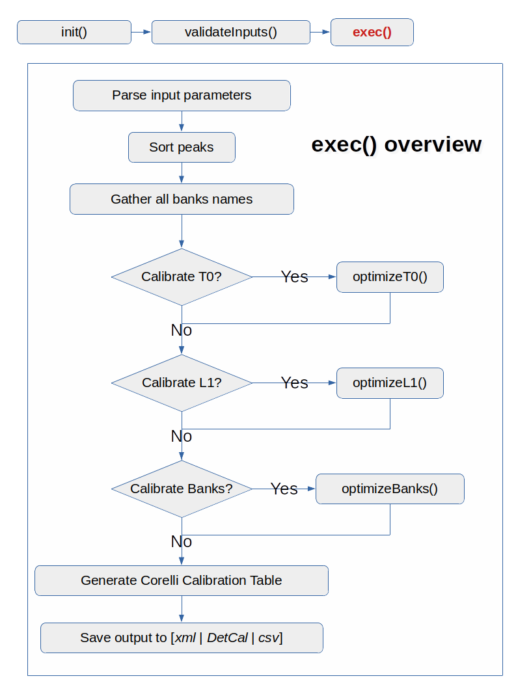
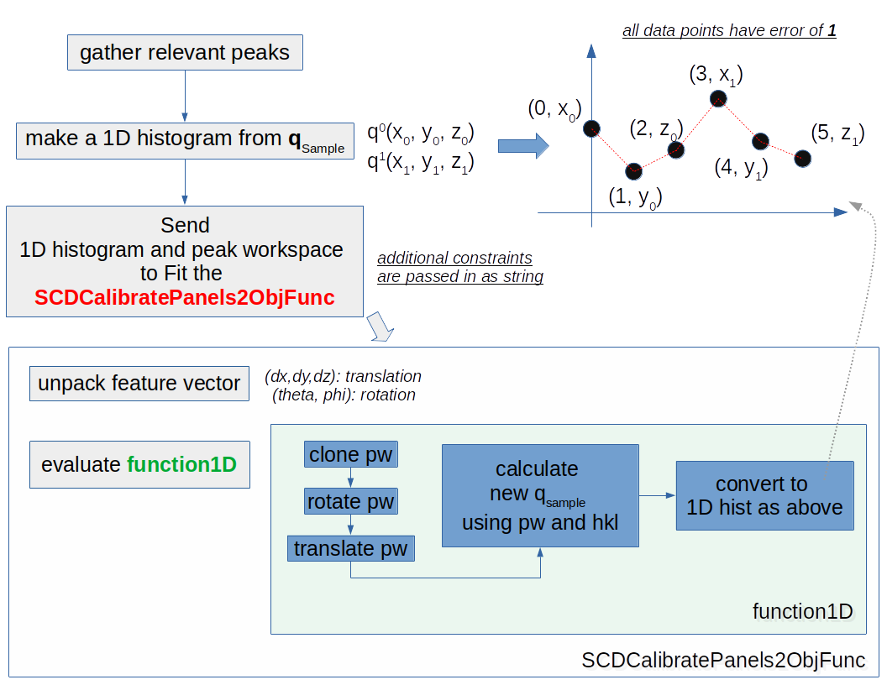

# Overview

This repo is for the debugging review of `mantid.SCDCalibratePanels2`.

| folder | content |
| :----: | :-----: |
| `data` | test data directory |
| `figures` | screenshots, flowchart, and function caller map |
| `src` | relevant source code* |

> * SHA: 6bc926804e2fa20a3a6b955c0a2c1e742378d5b8

# Background

The CORELLI team would like to use [`SCDCalibratePanels`](https://github.com/mantidproject/mantid/blob/master/Framework/Crystal/src/SCDCalibratePanels.cpp) (version 1) to calibrate the CORELLI instrument using single crystal data, which serves as additional calibration toolkit to existing powder calibration code.
Upon investigating the output of [`SCDCalibratePanels`](https://github.com/mantidproject/mantid/blob/master/Framework/Crystal/src/SCDCalibratePanels.cpp) (version 1), the following issues were found

- Unrealistic large bank movement (translation and rotation)
- Drifting L1 calibration outcome with consecutive runs
- Unnecessary redinexation during each evaluation of the objective function
- Confusing calibration log output

Due to the high complexity of [`SCDCalibratePanels`](https://github.com/mantidproject/mantid/blob/master/Framework/Crystal/src/SCDCalibratePanels.cpp), it is difficult to resolve the issues found above.
Therefore, a new version, `SCDCalibratePanels2`, was created targeting the CORELLI instrument.
As the CORELLI team does not have experiment data with know instrument position values, virtual diffraction based (synthetic data) unit test was used to assist the development of this new algorithm.

# Algorithm of interest

| filename | content |
| :------ | :-----: |
| [`SCDCalibratePanels2.h`](src/SCDCalibratePanels2.h) | header file with some prefined local constants |
| [`SCDCalibratePanels2.cpp`](src/SCDCalibratePanels2.cpp) | main algorithm file |
| [`SCDCalibratePanels2ObjFunc.h`](src/SCDCalibratePanels2ObjFunc.h) | header file of the objective function |
| [`SCDCalibratePanels2ObjFunc.cpp`](src/SCDCalibratePanels2ObjFunc.cpp) | Objecitve function source file |
| [`SCDCalibratePanels2Test.h`](src/SCDCalibratePanels2Test.h) | Unit test using virtual diffraction to generate synthetic peak workspace for algorithm validatino |

## Unittest

There are a total number of __five__ tests used to assist the development of `SCDCalibratePanels2`, including
- `run_Null_Case`:  trivial case, no source nor bank movement.
- `run_T0_Shift`: test if `SCDCalibratePanels2` can find T0 shift with zero source and bank movement. (note: `SCDCalibratePanels2` still cannot handle T0 calibration)
- `run_L1_Shift`: test if `SCDCalibratePanels2` can find prescribed L1 shift with zero bank movement.
- `run_bank_moved`: test if `SCDCalibratePanels2` can find prescirbed movement of a single bank (zero source movement)
- `test_Exec`: overall test of `SCDCalibratePanels2` where the source and two banks are moved.

> Note:  
> - There is a __3 min__ timeout limit configured for `ctest`, therefore the function name is changed from `test_*` to `run_*` once `SCDCalibratePanels2` passes the assocaited test.  
> - `test_Exec` is the main test running on build server.

All unit tests follow the following workflow.

## Calibration workflow

The overall calibration procedure is as straight forward as other algorithms.

The most important functions in `exec()` are
- `optimizeL1()`
- `optimizeBanks()`
> Note: due to unknown issue, `optimizeT0()` always returns zero output with current unittest.

Both `optimizeL1()` and `optimizeBanks()` follow a similar workflow with the following differences:

|             | `optimizeL1()` | `optimizeBanks()` |
|:----        |:--------------:|:-----------------:|
| peaks       | use all peaks avaialble | peaks are partitioned based on Bank |
| thread      | single thread calculation | `OpenMP` is used |
| component   | source only    | corresponding bank |
| constraints | z motion only  | all five degree of freedom |

The common workflow is shown below

# Discussion points

## [`SCDCalibratePanels2Test.h`](src/SCDCalibratePanels2Test.h)

- In the constructor `SCDCalibratePanels2Test()`, we need to call `LoadIsawPeaks` once to avoid strange `algorithm not found error` for the rest of the module.
  The mechanism behind this hack is still unclear.
- Is it possible to lift the 3 min timeout constraints on ctest?

## [`SCDCalibratePanels2.cpp`](src/SCDCalibratePanels2.cpp)

- Upon review, it seems like the lattice constants are not used (or used implicityly somehow?) in the main calibration process.
  - Users often call `setUB` before calling `SCDCalibratePanels`, therefore do we still need the lattice constants as input parameters
  - Version 1 always does a reindexation upon loading the lattice paramter, but this often leads to a `peaksworkspace contains non-indexed peak` error. What should we do in situations like this?
  - When does Mantid compute the crystal orientation? My understanding is that `indexPeaks` helps finding the HKL, but does it also produce the crystal orientation (EulerAngle, uv pair, or even quaternion)?
  - A quick test was performed where the lattice constants were forced set to the input peak workspace, and the issue still remains.

- Why do we have to sort peaks?(@L236) I am keeping it here because version one states clearly that it is necessary, but the physics behind it was not documented.

- Does Mantid provide a straight forward way to query all banks names other than asking each individual peaks and tabulating the results?
## [`SCDCalibratePanels2ObjFunc.cpp`](src/SCDCalibratePanels2ObjFunc.cpp)

- The original version has a weired first order derivative function, [functionDeriv1D()](https://github.com/mantidproject/mantid/blob/91cbdaa813527d00fb15700035c20c9f456bd678/Framework/Crystal/src/SCDPanelErrors.cpp#L260), which is causing the optimizatio drifting in a very erratic way. The function was removed in the newer version and somehow the unittest can produce reliable outcome that is close to numerical precision.
- The current way of generating calculated qSample feels very awkward, and different peak object instantiation is needed when dealing with source and banks.
  - A better and unified peak objective instantiation is definitely needed here.
