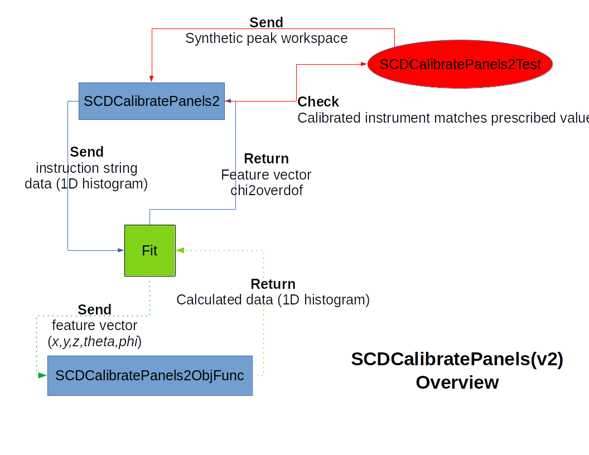

# Overview

This repo is for the debugging review of `mantid.SCDCalibratePanels2`.

| folder | content |
| :----: | :-----: |
| `data` | test data directory |
| `figures` | screenshots, flowchart, and function caller map |
| `src` | relevant source code* |

> * SHA: 6bc926804e2fa20a3a6b955c0a2c1e742378d5b8

# Background

The CORELLI team would like to use [`SCDCalibratePanels`](https://github.com/mantidproject/mantid/blob/master/Framework/Crystal/src/SCDCalibratePanels.cpp) (version 1) to calibrate the CORELLI instrument using single crystal data, which serves as additional calibration toolkit to existing powder calibration code.
Upon investigating the output of [`SCDCalibratePanels`](https://github.com/mantidproject/mantid/blob/master/Framework/Crystal/src/SCDCalibratePanels.cpp) (version 1), the following issues were found

- Unrealistic large bank movement (translation and rotation)
- Drifting L1 calibration outcome with consecutive runs
- Unnecessary redinexation during each evaluation of the objective function
- Confusing calibration log output

Due to the high complexity of [`SCDCalibratePanels`](https://github.com/mantidproject/mantid/blob/master/Framework/Crystal/src/SCDCalibratePanels.cpp), it is difficult to resolve the issues found above.
Therefore, a new version, `SCDCalibratePanels2`, was created targeting the CORELLI instrument.
As the CORELLI team does not have experiment data with know instrument position values, virtual diffraction based (synthetic data) unit test was used to assist the development of this new algorithm.

# Algorithm of interest

| filename | content |
| :------ | :-----: |
| [`SCDCalibratePanels2.h`](src/SCDCalibratePanels2.h) | header file with some prefined local constants |
| [`SCDCalibratePanels2.cpp`](src/SCDCalibratePanels2.cpp) | main algorithm file |
| [`SCDCalibratePanels2ObjFunc.h`](src/SCDCalibratePanels2ObjFunc.h) | header file of the objective function |
| [`SCDCalibratePanels2ObjFunc.cpp`](src/SCDCalibratePanels2ObjFunc.cpp) | Objecitve function source file |
| [`SCDCalibratePanels2Test.h`](src/SCDCalibratePanels2Test.h) | Unit test using virtual diffraction to generate synthetic peak workspace for algorithm validatino |

## Unittest

There are a total number of __five__ tests used to assist the development of `SCDCalibratePanels2`, including
- `run_Null_Case`:  trivial case, no source nor bank movement.
- `run_T0_Shift`: test if `SCDCalibratePanels2` can find T0 shift with zero source and bank movement. (note: `SCDCalibratePanels2` still cannot handle T0 calibration)
- `run_L1_Shift`: test if `SCDCalibratePanels2` can find prescribed `$L_1$` shift

> Note: There is a __3 min__ timeout limit configured for `ctest`, therefore the function name is changed from `test_*` to `run_*` once `SCDCalibratePanels2` passes the assocaited test.

## Calibration workflow

# Focused discussion point